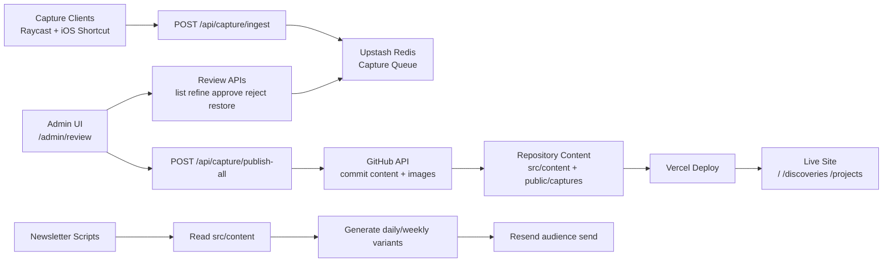

# Digital Garden

An Astro-based personal site with one unified learning stream (`learning.log`), plus a capture-and-review pipeline for publishing discoveries and project updates.

## Quick Start

```bash
npm install
npm run dev
```

Production build:

```bash
npm run build
```

## Architecture



For deeper diagrams and flow details, see [`docs/architecture.md`](docs/architecture.md).

## Repository Map

- `src/pages/`: site pages + API routes
- `src/content/`: source content (`discoveries`, `projects`)
- `src/lib/learning-log.ts`: unified stream normalization
- `src/lib/capture/`: capture pipeline (store, refine, transform, publish)
- `src/lib/newsletter/`: newsletter generation logic
- `capture-extension/`: Raycast extension for quick capture
- `ios-shortcut/SETUP.md`: iPhone Share Sheet capture setup
- `docs/`: system docs and runbooks

## Main Routes

- `/`: unified `learning.log` feed
- `/about/`: about page
- `/discoveries/[slug]/`, `/projects/[slug]/`: content detail pages
- `/admin/`: admin login
- `/admin/review`: capture review dashboard
- `/rss.xml`: unified RSS feed
- `/api/subscribe`: newsletter subscribe endpoint
- `/api/capture/*`: capture ingestion/review/publish APIs

## Content Model

Content lives in `src/content/` with two collections:

- `discoveries`: learnings and resources with `kind: 'learning' | 'resource'`
- `projects`: project metadata + `activity` timeline (with `activityType`)

The home feed combines both collections via `src/lib/learning-log.ts`.

## Newsletter Workflow

Required env vars:

- `RESEND_API_KEY`
- `RESEND_AUDIENCE_ID`
- `RESEND_FROM_EMAIL` (optional in dev)
- `SITE_URL` (recommended for absolute links)
- `NEWSLETTER_AUTOSEND=false` (manual mode)

Generate preview artifacts:

```bash
npm run newsletter:preview -- --type=daily
```

Send newsletter manually (explicit confirmation required):

```bash
npm run newsletter:send -- --type=daily --confirm=true
```

Preview files are written to `.tmp/newsletter-preview/`.

## Capture Workflow

Required env vars:

- `CAPTURE_API_KEY`
- `UPSTASH_REDIS_REST_URL`
- `UPSTASH_REDIS_REST_TOKEN`
- `ADMIN_PASSWORD`
- `GITHUB_TOKEN`
- `GITHUB_REPO`
- Optional: `CRON_SECRET`, `AI_PROVIDER`, `AI_MODEL`, provider API keys

Flow:

1. Ingest to Redis (`pending`)
2. Review in `/admin/review` (`refine`, `approve`, `reject`, `restore`)
3. Publish queued captures with `/api/capture/publish-all`
4. GitHub commit triggers one Vercel deployment

See [`docs/capture-system-plan.md`](docs/capture-system-plan.md) and [`capture-extension/README.md`](capture-extension/README.md).

## Deployment

Configured for Vercel using `@astrojs/vercel` (`astro.config.mjs`).

Cron for batch publishing is defined in `vercel.json` (`/api/capture/publish-all` daily at 08:00 UTC).

## License

MIT
