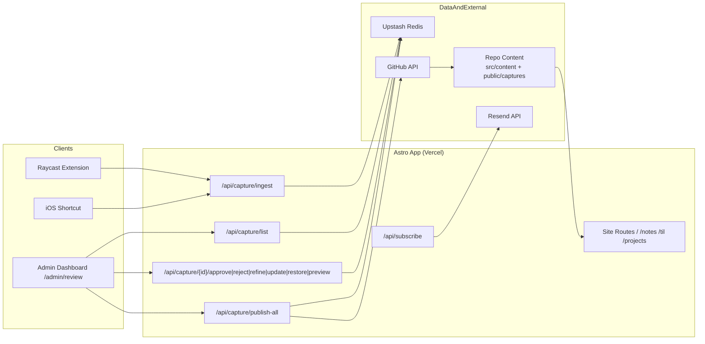
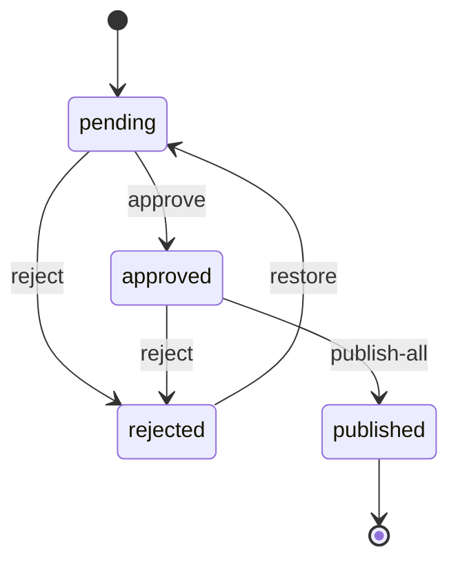
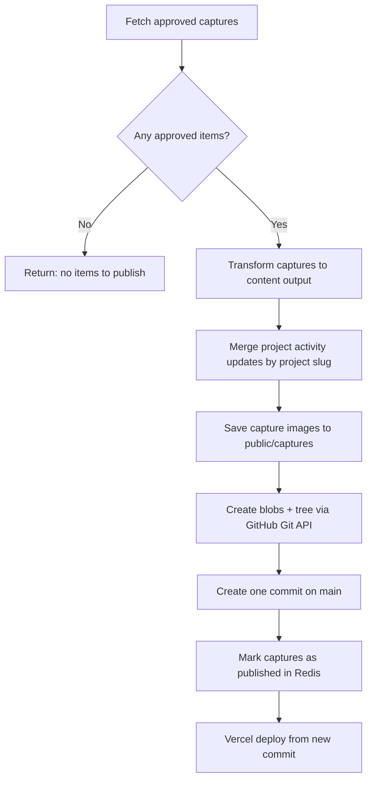

# Architecture Guide

This document explains how content moves through the system and where each responsibility lives.

## 1) System Context

## 2) Capture Lifecycle

## 3) Batch Publishing Flow

## 4) Directory Responsibilities

- `src/pages/`: user-facing pages and API routes.
- `src/lib/capture/`: capture domain logic.
- `src/lib/newsletter/`: newsletter content aggregation and rendering.
- `src/content/`: published notes, TILs, and projects.
- `capture-extension/`: Raycast client for desktop capture.
- `ios-shortcut/`: setup instructions for iOS capture.

## 5) Where To Start (New Contributor)

1. Read `README.md` for local setup and runbooks.
2. Read `src/content/config.ts` to understand schemas.
3. Read `src/lib/learning-log.ts` to see how the main feed is composed.
4. For capture features, follow this order:
   - `src/pages/api/capture/ingest.ts`
   - `src/lib/capture/store.ts`
   - `src/pages/admin/review.astro`
   - `src/lib/capture/publish.ts`
5. For newsletter features, start at:
   - `src/lib/newsletter/generate.mjs`
   - `scripts/newsletter-preview.mjs`
   - `scripts/newsletter-send.mjs`
