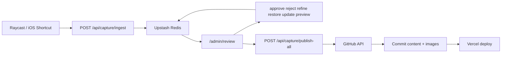

# Capture System Reference

Operational reference for the capture, review, and batch publishing flow.

## High-Level Flow



## Status Model

- `pending`: newly captured and awaiting review
- `approved`: reviewed and queued for batch publishing
- `rejected`: intentionally skipped
- `published`: successfully committed to content

## API Endpoints

| Route | Method(s) | Purpose |
| --- | --- | --- |
| `/api/capture/ingest` | `POST` | Capture entry point from clients |
| `/api/capture/list` | `GET` | List captures by status |
| `/api/capture/[id]/approve` | `POST` | Move pending -> approved |
| `/api/capture/[id]/reject` | `POST` | Move pending/approved -> rejected |
| `/api/capture/[id]/restore` | `POST` | Move rejected -> pending |
| `/api/capture/[id]/refine` | `POST` | Run AI refinement |
| `/api/capture/[id]/update` | `PATCH`, `POST` | Update capture metadata |
| `/api/capture/[id]/preview` | `GET` | Preview transformed output |
| `/api/capture/publish-all` | `POST`, `GET` | Batch publish approved captures |

## Main Modules

| File | Responsibility |
| --- | --- |
| `src/lib/capture/types.ts` | Capture domain types and transform outputs |
| `src/lib/capture/store.ts` | Redis persistence and status operations |
| `src/lib/capture/refine.ts` | AI refinement prompt + schema output |
| `src/lib/capture/transform.ts` | Capture -> notes/TIL/project activity transforms |
| `src/lib/capture/publish.ts` | GitHub commit and batch publish logic |
| `src/pages/admin/review.astro` | Review UI and moderation controls |

## Required Environment Variables

```bash
CAPTURE_API_KEY=...
UPSTASH_REDIS_REST_URL=...
UPSTASH_REDIS_REST_TOKEN=...
ADMIN_PASSWORD=...
GITHUB_TOKEN=...
GITHUB_REPO=username/digital-garden
```

Optional but recommended:

```bash
CRON_SECRET=...
AI_PROVIDER=google # openai | google | azure
AI_MODEL=gemini-2.5-flash
```

## Operations Runbook

1. Capture from Raycast or iOS -> item enters `pending`.
2. Open `/admin/review` and refine/edit as needed.
3. Approve items (moves them to `approved` queue).
4. Publish queued items via `Publish All` button (or cron).
5. Verify new content in `src/content` and live pages.

For broader system context diagrams, see `docs/architecture.md`.
