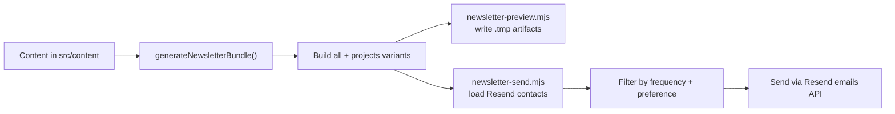

# Newsletter Workflow

Current newsletter workflow reference for this project.

## Overview

The newsletter system builds digests directly from `src/content` and sends two audience variants:

- `all`: notes + TIL + project updates
- `projects`: project updates only

Subscribers are filtered by:

- `frequency`: `daily` or `weekly`
- `preference`: `all` or `projects`

## Flow



## Commands

Preview (safe, local artifacts only):

```bash
npm run newsletter:preview -- --type=daily
```

Send (requires explicit confirmation):

```bash
npm run newsletter:send -- --type=daily --confirm=true
```

Optional flags:

- `--type=daily|weekly` (default `daily` for preview, `daily` fallback for send)
- `--date=YYYY-MM-DD` (window anchor)

## Files and Responsibilities

- `src/lib/newsletter/generate.mjs`: content collection, filtering, rendering.
- `scripts/newsletter-preview.mjs`: writes HTML/TXT/JSON preview artifacts.
- `scripts/newsletter-send.mjs`: recipient selection + sending.
- `src/pages/api/subscribe.ts`: captures subscriber preferences in Resend audience.

## Required Environment Variables

```bash
RESEND_API_KEY=...
RESEND_AUDIENCE_ID=...
RESEND_FROM_EMAIL=optional
SITE_URL=optional
```

`SITE_URL` is recommended so links/images become absolute in generated emails.

## Output Artifacts

Preview outputs are written to:

- `.tmp/newsletter-preview/*.all.html`
- `.tmp/newsletter-preview/*.all.txt`
- `.tmp/newsletter-preview/*.projects.html`
- `.tmp/newsletter-preview/*.projects.txt`
- `.tmp/newsletter-preview/*.summary.json`

## Safety Rules

- Send script exits unless `--confirm=true` is provided.
- Unsubscribed contacts are skipped.
- Contacts are filtered to matching send cadence (`daily` or `weekly`).
- Any send failures are reported and exit with non-zero status.
