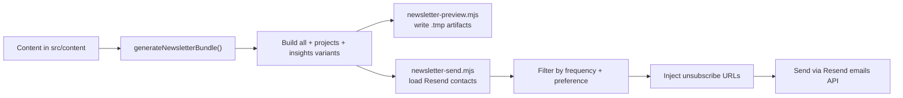

# Newsletter Workflow

Current newsletter workflow reference for this project.

## Overview

The newsletter system builds digests directly from `src/content` and sends three audience variants:

- `all`: notes + TIL + project updates
- `projects`: project updates only
- `insights`: notes + TIL only (no project updates)

Subscribers are filtered by:

- `frequency`: `daily` or `weekly`
- `preference`: `all`, `projects`, or `insights`

## Flow



## Commands

Preview (safe, local artifacts only):

```bash
npm run newsletter:preview -- --type=daily
```

Send (requires explicit confirmation):

```bash
npm run newsletter:send -- --type=daily --confirm=true
```

Optional flags:

- `--type=daily|weekly` (default `daily` for preview, `daily` fallback for send)
- `--date=YYYY-MM-DD` (window anchor)

## Files and Responsibilities

- `src/lib/newsletter/generate.mjs`: content collection, filtering, rendering
- `src/lib/newsletter/unsubscribe.ts`: generates signed unsubscribe tokens
- `src/lib/newsletter/rate-limit.ts`: IP-based rate limiting for subscribe endpoint
- `scripts/newsletter-preview.mjs`: writes HTML/TXT/JSON preview artifacts
- `scripts/newsletter-send.mjs`: recipient selection, unsubscribe URL injection, sending
- `src/pages/api/subscribe.ts`: captures subscriber preferences with rate limiting + honeypot protection
- `src/pages/api/unsubscribe.ts`: handles unsubscribe link clicks

## Required Environment Variables

```bash
RESEND_API_KEY=...
RESEND_AUDIENCE_ID=...
RESEND_FROM_EMAIL=optional (defaults to onboarding@resend.dev)
SITE_URL=required for sending (used in unsubscribe links)
UNSUBSCRIBE_SECRET=required for sending (signs unsubscribe tokens)
```

`SITE_URL` is required for sending so that unsubscribe links work correctly.

For rate limiting (optional but recommended):

```bash
UPSTASH_REDIS_REST_URL=...
UPSTASH_REDIS_REST_TOKEN=...
```

## Output Artifacts

Preview outputs are written to:

- `.tmp/newsletter-preview/*.all.html`
- `.tmp/newsletter-preview/*.all.txt`
- `.tmp/newsletter-preview/*.projects.html`
- `.tmp/newsletter-preview/*.projects.txt`
- `.tmp/newsletter-preview/*.insights.html`
- `.tmp/newsletter-preview/*.insights.txt`
- `.tmp/newsletter-preview/*.summary.json`

## Safety Rules

- Send script exits unless `--confirm=true` is provided.
- Send script requires `SITE_URL` and `UNSUBSCRIBE_SECRET` environment variables.
- Unsubscribed contacts are skipped.
- Contacts are filtered to matching send cadence (`daily` or `weekly`).
- Any send failures are reported and exit with non-zero status.

## Bot Protection

The subscribe endpoint includes:

1. **Honeypot field**: Hidden `website` field that bots fill but humans don't see
2. **Rate limiting**: 3 attempts per IP per hour (requires Upstash Redis)

Rate limiting fails open if Redis is not configured (allows requests to proceed).

## Unsubscribe Flow

1. Each newsletter email contains a signed unsubscribe link unique to that recipient
2. Clicking the link hits `/api/unsubscribe?token=xxx`
3. Token is validated (checks signature and 90-day expiry)
4. Contact is marked as unsubscribed in Resend audience
5. User sees confirmation page
